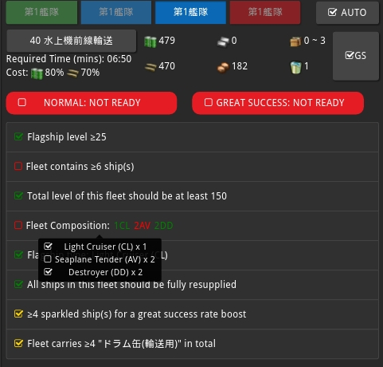
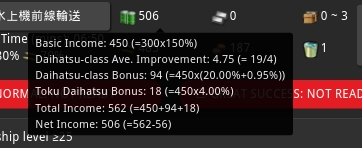
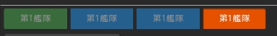

# EZ Exped: Expedition Made Easy

EZ Exped is a [poi](https://github.com/poooi/poi) plugin that helps you
check expedition requirements and estimate expedition income accurately.

## Changelog

### 1.5.0 (pending)

- Improved some wording for zh-CN and zh-TW (thanks to @noobwithnohats#0245!)
- Removing "Missing Info" due to lack of further detail.

### 1.4.4

- Put back "Missing Info" for B1, as there are reports that fleet
  meeting all these requirements are still failing.

- Fix a problem where DLC toggle is not handled correctly.

### 1.4.3

- Update requirement check for B1. Subject to change just like other new expeditions.

### 1.4.2

- Marked Michishio Kai Ni as DLC-capable

- Early support for new expedition B1

### 1.4.1

- Some improvement to expedition selector

    - Now an expedition appears only if you've unlocked them in game.
      But event support expedition won't appear just like before.

    - Making button layout a bit more compact

- Implemented checkers for A1, A2, A3

    - Subject to change, as investigations are still in progress. But should be good enough.

    - References:

      - [wikiwiki](http://wikiwiki.jp/kancolle/?%B1%F3%C0%AC)
      - [A2 海峡警備行動 調査](https://docs.google.com/spreadsheets/d/1BM2SCpxuZRMY0R9ipptY6jQ1-v51tOijBJ8Fofpx33c/)

### 1.4.0

- Deal with new expeditions temporarily

    - Keep in mind that all requirements for new expeditions should be considered temporary
      and are very likely to be changed in future as more investigations are done.

    - Placed a new checker on new expeditions, which cannot be satisfied.
      This serves as an indication that a complete check is not yet available.

    - Implemented new fleet ASW stat checker.

- Using "display number" for expeditions.

    Examples:

    - `Expedition #1` is now `Expedition #01`

    - `Expedition #A1` is used instead of `100`.
      (The latter one is internal id of the expedition)

### 1.3.1

- Fix a problem when default setting is not being properly loaded for new users.

### 1.3.0

- Added new checker to make sure a fleet carries as many Daihatsu-class equipments as one can.

    - Only "大発動艇" and "特大発動艇" are taken into account, since the other few
      either does not provide significant boost or is mainly used for non-expedition purposes.

    - Like great success toggle, this checker can be turn on or off for each expedition.

    - Should be smart enough so that it won't bother you when you simply
      don't have enough Daihatsu in your possession.

### 1.2.1

- Added translation for Japanese (thanks to @KochiyaOcean)

### 1.2.0

- [Kancepts](https://javran.github.io/kancepts/) can now be launched from plugin.

    - Optionally you can export your ship list, which could improve the accuracy
      of the cost model a bit. (This is enabled by default, but can be easily disabled)

- For composition requirements that have alternatives,
  The 'dangerous' coloring is only used when the whole requirement is not satisfied.

  This is to respect the convention that whenever something is in red ('dangerous'),
  it's highly likely that something is wrong.

### 1.1.1

- Just switching to use subtender for utility functions. No changes are made on the surface.

### 1.1.0

- New option "Sync with main fleet focus" (disabled by default)

    This option keeps fleet focus in sync with that of main program's.
    Note that if you have EZ Exped's auto fleet switch feature turned on,
    it'll also switch main fleets' focus.

### 1.0.0

#### Escort- / Escort Carrier-Related Expeditions

- Added Fleet composition requirements related to `DE` and `CVE`

    - See [Reference](https://docs.google.com/spreadsheets/d/17Fe9x9L7GXNtO88NOak_wqKtcUwtMr4Utl9l9vq367s/edit#gid=1571341102) for details

    - `DE` is short for escort, and `CVE` for escort carriers.

    - For now the only implemented escort carriers (`CVE`) in game are Kasuga Maru and her remodels.
      Namely one of the following:

        - Kasuga Maru
        - Taiyou
        - Taiyou Kai
        - Taiyou Kai Ni

    - Basically Expedition `#4`, `#5`, `#9` allow alternative fleet compositions
      in addition to the traditional `1CL 2DD`.

    - Added fleet compositions are: `1DD 3DE`, `1CL 2DE`, `1CT 2DE`, `1CVE 2DE`, `1CVE 2DD`.

    - For 3 expeditions mentioned above, one only need to achieve one of these fleet compositions to
      pass the fleet composition check. However, it's still necessary to meet requirements
      other than fleet composition
      (e.g. flagship level requirement, number-of-ships requirement, etc.)

#### UI Improvments

- Improvements to fleet selector

    - Improved fleet button tooltips

        - Shows description of current fleet status

        - Shows ship level, morale status and expedition-related equipments

- Improvements to requirement viewer & expedition selector

    - Added fleet indicators to expedition buttons

    - Expedition button turns golden when great success check passes

    - Improved expedition table tooltip

    - "Great Success" toggle turns golden when it's on

- Requirement list now provides more details

- Added a "Great Success" effect on expedition selector buttons

- Make some parts of the UI respect theme settings

#### Other Improvments & Fixes

- Improved fleet auto switch mechanism

- Improved requirement checking mechanism

### 0.5.0

- Remove "Allow switching to this plugin automatically"

    - This setting is now handled by main program so we no longer need a redundant one for exactly same purpose.

- Handle expedition result screen action

    - Switch to this plugin when user is on expedition result screen
    - Also focus the related fleet tab if fleet auto-switch is on

- Right clicking on a fleet button will cause main UI to switch to that particular fleet.

- Remove data migration code.

    - If you are updating from 0.4.1 or 0.4.2, nothing should have been changed
    - Otherwise some settings might be reset to their detaults.

### 0.4.2

- Compatibility, no behavior change.

### 0.4.1

- User data migration from localStorage to poi config.

    Nothing should have been changed on the surface.

- Improved fleet Auto Switch logic

    Removing equipments from a fleet member triggers auto switch.

### 0.4.0

- Allow hiding main fleet from tab, disabled by default.

    "Main fleet" is usually your first fleet. But when you have a combined fleet,
    your second fleet is also considered part of it.

- Allow hiding satisfied requirements.

- Auto Switch interacts with "Hide Main Fleet" setting.

    - If all possible fleets are sent out, with "Hide Main Fleet" on, Auto Switch won't try
      to focus your main fleet.

### 0.3.1

- Adding "All ships need to be sparkled" requirement for great success expeditions

    Exceptions are Expedition 21 / 24 / 37 / 38 / 40 (usually referred to as "overdrum expeditions"),
    For non-overdrum expeditions, it's a requirement that all ships in fleet need to be sparkled.
    However, you can have less than 5 ships in a fleet and still get great success
    given that all regular expedition requirements are met.

- Allow customizing "number of sparkled ships" to `3`.

### 0.3.0

- Allow customizing the number of sparkled ships for great success on non-overdruming expeditions
- Now user can opt-in plugin auto-switch feature.

    This feature is turned off by default. When enabled, poi switches to this plugin automatically
    when user goes to the in-game expedition screen.

### 0.2.3

- Fix errors when not all fleets are unlocked in game

### 0.2.2

- Fix errors caused by missing translations

## Features

### Expedition Requirement Checker

Check your fleet against expedition requirements. Now all you have to do
is to take a look at unmet requirements and adjust your fleet & equipments accordingly.

### Accurate Resource Income Estimation

Great Success, all kinds of Daihatsu Landing Craft, their improvement levels
and resupply cost, all taken into account.

### Auto Switch

Always show you the most related fleet depending on your in-game action:

- Automatically switch to the fleet you are working on (changing fleet composition or ship equipments)
- Automatically switch to the fleet you are about to send out for expedition, allows a last minute confirmation.

Note that when all of your fleets are sent out, by default Auto Switch will try to focus your main fleet,
this is intended behavior as your main fleet becomes the only fleet which you can change its composition.
However, this behavior is disabled when "Hide Main Fleet" option is on.

### Colorful Fleet Indicator

The Fleet Indicator allows you to tell whether a fleet is ready for the expedition you have specfied
without even taking a close look at it.

- Green: This fleet is ready for the expedition or you cannot send this fleet out for expedition.
- Blue: This fleet is not available, perhaps due to an on-going expedition.
- Orange: This fleet is almost ready for the expedition, all you have to do is to resupply this fleet and send them out again.
- Red: This fleet has some unmet requirements more than just resupply issue.

Note that these colors may vary depending on your theme.
